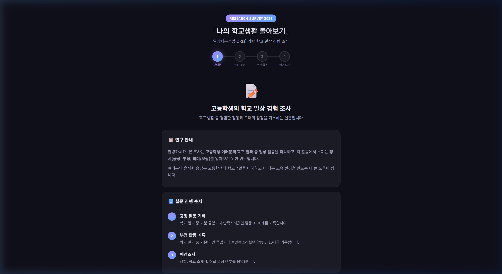
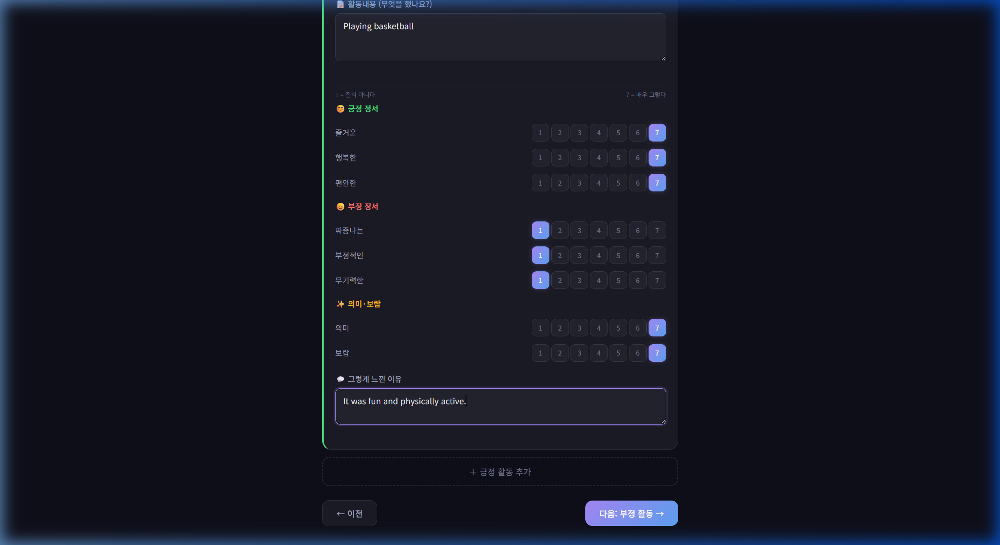
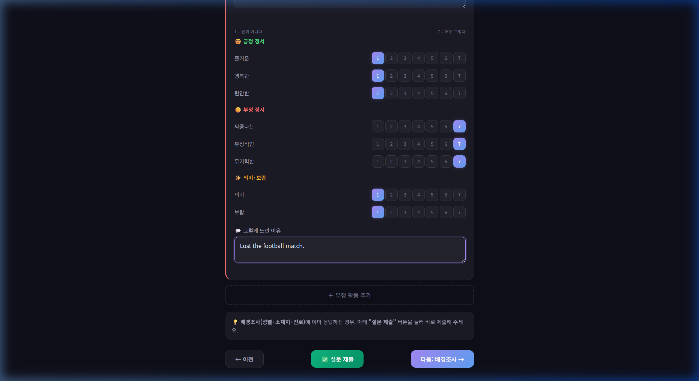
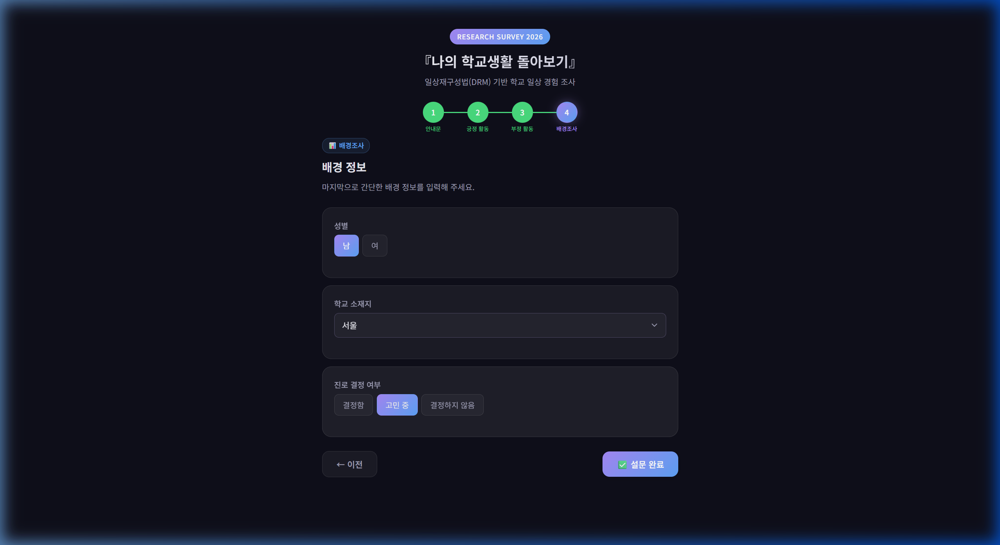
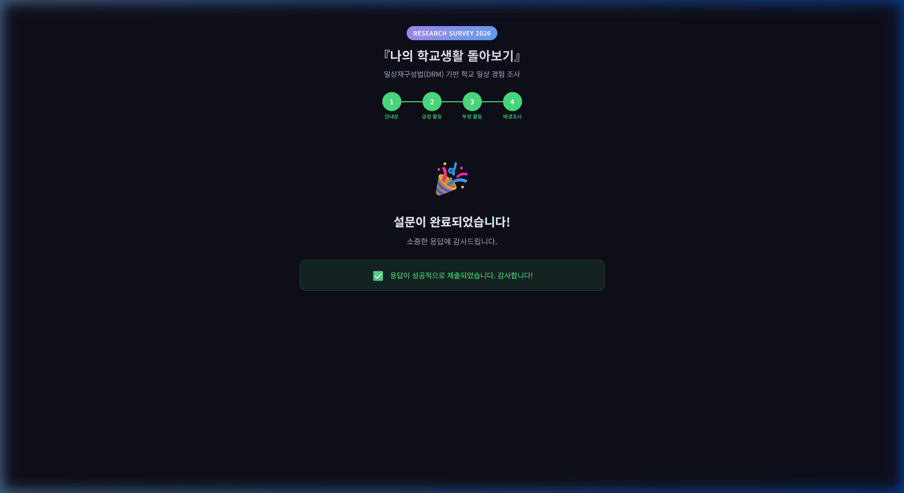

# DRM2 테스트 결과

> **테스트 일시**: 2026-03-20 16:16 KST  
> **테스트 환경**: localhost:8080 (Python HTTP Server)  
> **테스트 방법**: End-to-End 브라우저 자동화 테스트

---

## 테스트 요약

| 단계 | 항목 | 결과 |
|------|------|------|
| 1 | 안내문 페이지 렌더링 | ✅ 통과 |
| 2 | 핸드폰 번호 입력 | ✅ 통과 |
| 3 | 긍정 활동 3개 입력 | ✅ 통과 |
| 4 | 부정 활동 3개 입력 | ✅ 통과 |
| 5 | 배경조사 입력 | ✅ 통과 |
| 6 | 데이터 제출 | ✅ 통과 |
| 7 | 완료 화면 표시 | ✅ 통과 |

**전체 결과: ✅ 모든 테스트 통과**

---

## 1. 안내문 (Intro Page)

### 확인 항목
- [x] 헤더 (Research Survey 2026) 렌더링
- [x] 설문 제목 및 부제목 표시
- [x] 프로그레스 바 (4단계) 표시
- [x] 연구 안내 카드 표시
- [x] 설문 진행 순서 (3단계) 표시
- [x] 핸드폰 번호 입력 필드
- [x] 설문 시작하기 버튼

### 테스트 데이터
- 핸드폰 번호: `010-1234-5678`

---

## 2. 긍정 활동 기록

### 확인 항목
- [x] 활동 카드 동적 추가 (3개)
- [x] 시간대 드롭다운 선택
- [x] 함께한 사람 드롭다운 선택
- [x] 장소 드롭다운 선택
- [x] 활동 내용 텍스트 입력
- [x] 정서 평가 (8개 항목, 7점 리커트) 선택
- [x] 이유 텍스트 입력
- [x] 프로그레스 바 업데이트 (2단계 활성화)

### 테스트 데이터
- 활동 1: 예시 데이터 (프리필)
- 활동 2~3: 테스트 데이터 수동 입력

---

## 3. 부정 활동 기록

### 확인 항목
- [x] 활동 카드 동적 추가 (3개)
- [x] 모든 입력 필드 정상 작동
- [x] 정서 평가 선택 정상
- [x] 배경조사 이미 응답 안내 메시지 표시
- [x] "설문 제출" 버튼 (건너뛰기) 표시
- [x] "다음: 배경조사" 버튼 표시

---

## 4. 배경조사 (Demographics)

### 확인 항목
- [x] 성별 라디오 버튼 (남/여)
- [x] 학교 소재지 드롭다운 (17개 시·도)
- [x] 진로 결정 여부 라디오 버튼 (3개 선택지)
- [x] 프로그레스 바 업데이트 (4단계 활성화)

### 테스트 데이터
- 성별: 남
- 학교 소재지: 서울
- 진로 결정 여부: 고민 중

---

## 5. 완료 화면 (Completion)

### 확인 항목
- [x] 🎉 완료 아이콘 표시
- [x] "설문이 완료되었습니다!" 메시지
- [x] ✅ "응답이 성공적으로 제출되었습니다. 감사합니다!" 성공 메시지
- [x] Google Sheets 데이터 전송 성공

---

## 발견된 이슈

| # | 심각도 | 이슈 | 상태 |
|---|--------|------|------|
| 1 | 낮음 | `favicon.ico` 404 오류 (기능 영향 없음) | 알려진 이슈 |

---

## 콘솔 로그

테스트 중 JavaScript 오류 없음. `favicon.ico` 404 외에 특이사항 없음.
